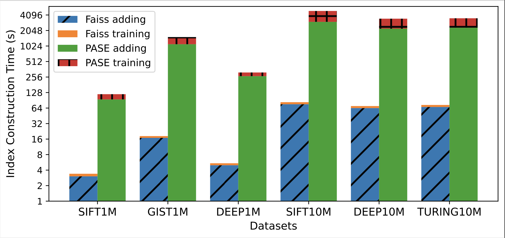
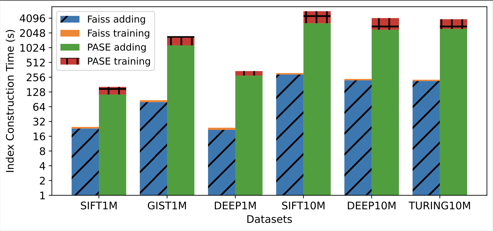
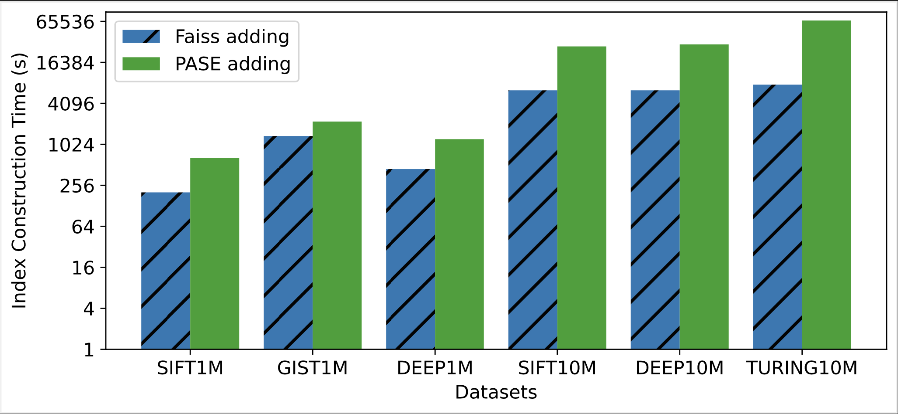
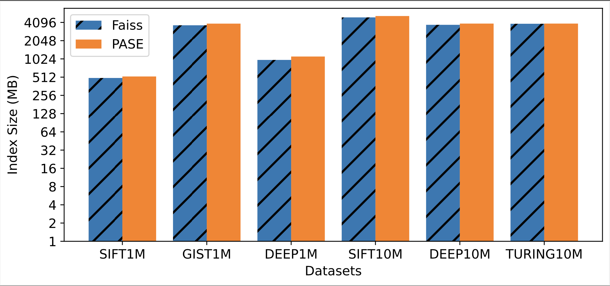
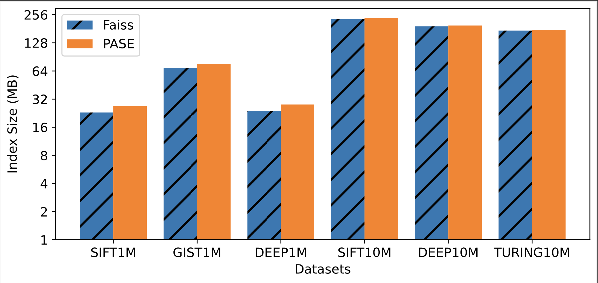
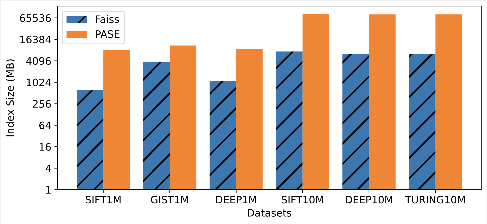
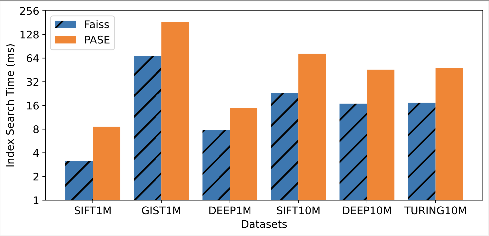
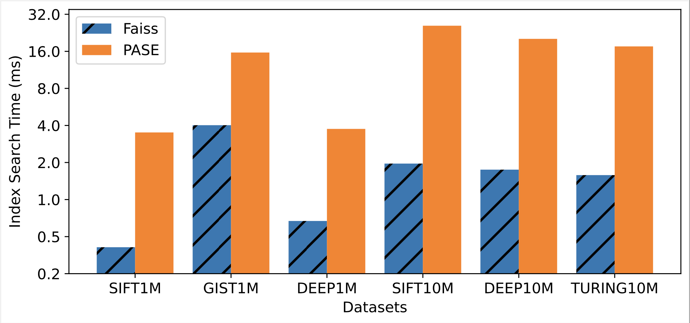
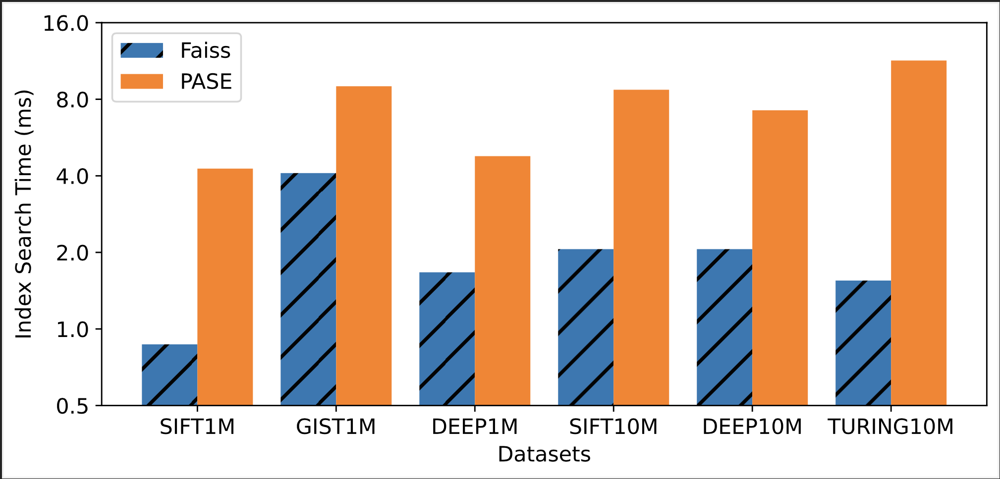

# Are There Fundamental Limitations in Supporting Vector Data Management in Relational Databases? A Case Study of PostgreSQL

High-dimensional vector data is gaining increasing importance in data science applications. Consequently, various database systems have recently been developed to manage vector data. These systems can be broadly categorized into two types: specialized and generalized vector databases.

Specialized vector databases are explicitly designed and optimized for storing and querying vector data, while generalized vector databases support vector data management within a relational database like PostgreSQL. It is expected (and confirmed by our experiments) that generalized vector databases exhibit slower performance. However, it is not clear whether there are fundamental limitations (or just implementation issues) for relational databases to support vector data management. 

We chose PostgreSQL as a representative relational database due to its popularity. And we focused on Alibaba PASE, as it is a PostgreSQL-based vector database and is also the state-of-the-art among all generalized vector databases. We instrumented the source code of PASE and compared its performance with the fastest specialized vector database to identify the underlying root causes of the performance gap and analyze how to bridge the gap. Based on our results, we provide insights and directions for building a future generalized vector database that can achieve comparable performance to the state-of-the-art specialized vector database.


# Repository Contents

## **postgresql-11.0** 
This directory contains the source code distribution of the PostgreSQL
database management system.


## **Faiss** 
This directory contains the source code of Faiss, a library for efficient similarity search and clustering of dense vectors

* **faiss/IndexIVFFlat.cpp:** Faiss index IVF_FLAT implementation

* **faiss/IndexIVFPQ.cpp:** Faiss index IVF_PQ implementation

* **faiss/IndexHNSW.cpp:** Faiss index HNSW implementation


## **PASE**

Code of PASE is in the directory **postgresql-11.0/contrib/pase**. 

* **ivfflat:** PASE index IVF_FLAT implementation

* **ivfpq:** PASE index IVF_PQ implementation

* **hnsw:** PASE index HNSW implementation

* **sql:** Sample SQL file for PASE

* **type:** Data types used in PASE

* **utils:** Util functions used in PASE

We implemented index IVF_PQ in PASE and the code is in **postgresql-11.0/contrib/pase/ivfpq**.

# Prerequisite

OpenMP 4.0.1

# Getting the Source
`git clone https://github.com/Anonymous-Vec/Vec-Exp.git`

## How to use PASE

### Start PostgreSQL

#### Checking the Required Environment

`sudo apt-get install build-essential libreadline-dev zlib1g-dev flex bison libxml2-dev libxslt-dev libssl-dev libxml2-utils xsltproc ccache`

`wget https://ftp.postgresql.org/pub/source/v11.0/postgresql-11.0.tar.gz`

`tar -zxvf postgresql-11.0.tar.gz`

Code of PG11 here can not be used directly since some importance files are not uploaded by git.

`cd postgresql-11.0`

#### Configure

`mkdir build`

`./configure --prefix=$/absolute/path/build CFLAGS="-O3" LDFLAGS="-fPIC -fopenmp" `

#### Compile
`make`

`make install`


#### Initial new cluster named "data" on a folder:

`build/bin/initdb -D data`

#### Set the size of shared buffer in postgresql-11.0/build/data/postgresql.conf/:
`shared_buffers = 160GB`

### Start PASE

`cd contrib/pase`

#### May need to change the Makefile:
`PG_CONFIG=postgresql-11.0/build/bin/pg_config`
#### Compile the PASE
`make USE_PGXS=1`

`make install`
	
#### Start the cluster:
`cd ../..`

`build/bin/pg_ctl -D data start` 
#### Create a database named "pasetest"
`build/bin/createdb -p 5432 pasetest`
#### Connect the database
`build/bin/psql -p 5432 pasetest`

### EXAMPLE CODE Used in Psql Command Line
#### Create Extension

`create extension pase;`

#### Create Table

`CREATE TABLE vectors_ivfflat_test ( id serial, vector float4[]);`

```
INSERT INTO vectors_ivfflat_test SELECT id, ARRAY[id
       ,1,1,1,1,1,1,1,1,1,1
       ,1,1,1,1,1,1,1,1,1,1
       ,1,1,1,1,1,1,1,1,1,1
       ,1,1,1,1,1,1,1,1,1,1
       ,1,1,1,1,1,1,1,1,1,1
       ,1,1,1,1,1,1,1,1,1,1
       ,1,1,1,1,1,1,1,1,1,1
       ,1,1,1,1,1,1,1,1,1,1
       ,1,1,1,1,1,1,1,1,1,1
       ,1,1,1,1,1,1,1,1,1,1
       ,1,1,1,1,1,1,1,1,1,1
       ,1,1,1,1,1,1,1,1,1,1
       ,1,1,1,1,1,1,1,1,1,1
       ,1,1,1,1,1,1,1,1,1,1
       ,1,1,1,1,1,1,1,1,1,1
       ,1,1,1,1,1,1,1,1,1,1
       ,1,1,1,1,1,1,1,1,1,1
       ,1,1,1,1,1,1,1,1,1,1
       ,1,1,1,1,1,1,1,1,1,1
       ,1,1,1,1,1,1,1,1,1,1
       ,1,1,1,1,1,1,1,1,1,1
       ,1,1,1,1,1,1,1,1,1,1
       ,1,1,1,1,1,1,1,1,1,1
       ,1,1,1,1,1,1,1,1,1,1
       ,1,1,1,1,1,1,1,1,1,1
       ,1,1,1,1,1
       ]::float4[] FROM generate_series(1, 50000) id;
```

#### Build Index

```
CREATE INDEX v_ivfflat_idx ON vectors_ivfflat_test
       USING
         pase_ivfflat(vector)
  WITH
    (clustering_type = 1, distance_type = 0, dimension = 256, clustering_params = "10,100");
```

#### Search Index

```
SELECT vector <#> '31111,1,1,1,1,1,1,1,1,1,1,1,1,1,1,1,1,1,1,1,1,1,1,1,1,1,1,1,1,1,1,1,1,1,1,1,1,1,1,1,1,1,1,1,1,1,1,1,1,1,1,1,1,1,1,1,1,1,1,1,1,1,1,1,1,1,1,1,1,1,1,1,1,1,1,1,1,1,1,1,1,1,1,1,1,1,1,1,1,1,1,1,1,1,1,1,1,1,1,1,1,1,1,1,1,1,1,1,1,1,1,1,1,1,1,1,1,1,1,1,1,1,1,1,1,1,1,1,1,1,1,1,1,1,1,1,1,1,1,1,1,1,1,1,1,1,1,1,1,1,1,1,1,1,1,1,1,1,1,1,1,1,1,1,1,1,1,1,1,1,1,1,1,1,1,1,1,1,1,1,1,1,1,1,1,1,1,1,1,1,1,1,1,1,1,1,1,1,1,1,1,1,1,1,1,1,1,1,1,1,1,1,1,1,1,1,1,1,1,1,1,1,1,1,1,1,1,1,1,1,1,1,1,1,1,1,1,1,1,1,1,1,1,1,1,1,1,1,1,1,1,1,1,1,1,1'::pase as distance
    FROM vectors_ivfflat_test
    ORDER BY
    vector <#> '31111,1,1,1,1,1,1,1,1,1,1,1,1,1,1,1,1,1,1,1,1,1,1,1,1,1,1,1,1,1,1,1,1,1,1,1,1,1,1,1,1,1,1,1,1,1,1,1,1,1,1,1,1,1,1,1,1,1,1,1,1,1,1,1,1,1,1,1,1,1,1,1,1,1,1,1,1,1,1,1,1,1,1,1,1,1,1,1,1,1,1,1,1,1,1,1,1,1,1,1,1,1,1,1,1,1,1,1,1,1,1,1,1,1,1,1,1,1,1,1,1,1,1,1,1,1,1,1,1,1,1,1,1,1,1,1,1,1,1,1,1,1,1,1,1,1,1,1,1,1,1,1,1,1,1,1,1,1,1,1,1,1,1,1,1,1,1,1,1,1,1,1,1,1,1,1,1,1,1,1,1,1,1,1,1,1,1,1,1,1,1,1,1,1,1,1,1,1,1,1,1,1,1,1,1,1,1,1,1,1,1,1,1,1,1,1,1,1,1,1,1,1,1,1,1,1,1,1,1,1,1,1,1,1,1,1,1,1,1,1,1,1,1,1,1,1,1,1,1,1,1,1,1,1,1,1'::pase
     ASC LIMIT 10;
```


### Original PASE Code:

- [Pase: PostgreSQL Ultra-High Dimensional Approximate Nearest Neighbor Search Extension](https://github.com/alipay/PASE)

## How to use Faiss

### Prerequisite

C++11 compiler (with support for OpenMP support version 2 or higher)


BLAS implementation (we strongly recommend using Intel MKL for best performance).

`sudo apt install intel-mkl`

`sudo apt-get install -y libopenblas-dev` 


CMake minimum required(VERSION 3.17)


### Compile and Build:
`cd faiss`

`cmake -B build . -DFAISS_ENABLE_GPU=OFF -DFAISS_ENABLE_PYTHON=OFF -DCMAKE_BUILD_TYPE=Release -DFAISS_OPT_LEVEL=generic `

`make -C build -j faiss`  

`sudo make -C build install` 

`make -C build 2-IVFFlat`

### Run the Example Code:
`./build/tutorial/cpp/2-IVFFlat` 

### Original Faiss Code:

- [Faiss: A Library for Efficient Similarity Search and Clustering of Dense Vectors](https://github.com/facebookresearch/faiss)

# Comparison Results

## Evaluating Index Construction

### IVF_FLAT

### IVF_PQ

### HNSW



## Evaluating Index Size

### IVF_FLAT

### IVF_PQ

### HNSW


## Evaluating Search Performance

### IVF_FLAT

### IVF_PQ

### HNSW



## We summarize the root causes of the performance gap as follows:

* **RC#1: SGEMM Optimization.**

* **RC#2: Tuple Accesses.**

* **RC#3: Parallel Execution.**

* **RC#4: Space Utilization.**

* **RC#5: K-means Implementation.**

* **RC#6: Heap Size in Top-k Computation.**

* **RC#7: Precomputed Table Implementation.**

## Future Direction: How to Bridge the Gap?

A follow-up of the work is how to overcome the root causes? In other words, how to build a new generalized vector database in the future that achieves comparable performance to the state-of-the-art specialized vector database? We show a few actionable guidelines and we are currently working on it.
* Step#1: Start from PostgreSQL-based PASE (or other relational databases). In order to overcome RC#2, there are different solutions. The first solution is to start from PASE, which is based on PostgreSQL. But we need to optimize HNSW by embedding the actual vector data to the index, which can avoid unnecessary random accesses to fetch vector data during graph traversal. The second solution is to add a memory-optimized table in PostgreSQL following GaussDB or use a main-memory relational database (e.g., MonetDB) to directly access tuples (vectors) in memory to reduce the overhead of tuple accesses.
* Step#2: Enable SGEMM. The system shall enable SGEMM to bypass the overhead of RC#1 and significantly improve the performance of index construction.
* Step#3: Optimized top-k computation. The system shall use the proper heap size (i.e., k) for top-k computation to overcome the overhead introduced by RC#6.
* Step#4: Parallelism. The system shall efficiently support both index construction and index search with multiple threads. This requires the implementation of the operator-level (e.g., vector search) parallelism in relational databases, which can bridge the performance gap due to RC#3.
* Step#5: More optimized implementations. The system needs to reduce space amplification, support optimized K-means and precomputated table as mentioned in RC#4, RC#5, and RC#7.

## Overall Message. 

The overall conclusion of the work is that, with a careful implementation, it is feasible to support vector data management inside a relational database that achieves comparable performance to the state-of-the-art specialized vector database. We do not see a fundamental limitation in using a relational database to support efficient vector data management. In this way, we can use a single relational database to support more applications that involve tables and vectors. The paper lays out seven useful root causes with actionable guidelines to build a generalized vector database step by step to achieve both high performance and generality in the future.